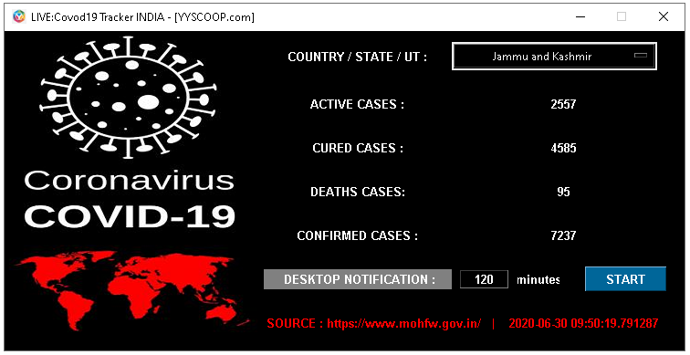

# LIVE: Covid-19 Tracker
>An app to track impact of COVID-19 in India. Shows the most recent data, and notify with updates cases. Statistics including the statewise number of confirmed, recovered, and deaths cases.


## Usage

1. Open your Terminal/cmd

2. git clone this project to your preferred directory.

3. `cd covid19_tracker`

4. `python covid19_tracker.py`

<br/>

or Execute:

```
ExecuteCovid19_Tracker.cmd
```


## Dependencies

- Requests (https://requests.readthedocs.io/)
- Beautifulsoup (https://beautiful-soup-4.readthedocs.io/)
- Plyer (https://plyer.readthedocs.io/)

## Installation
Set up a virtual environment and install the dependencies:
```sh
pip install -r requirements.txt
```

## License
This project is licensed under the terms of the [GLP-3.0 license](https://github.com/yyscoop/covid19_tracker/blob/master/LICENSE)
